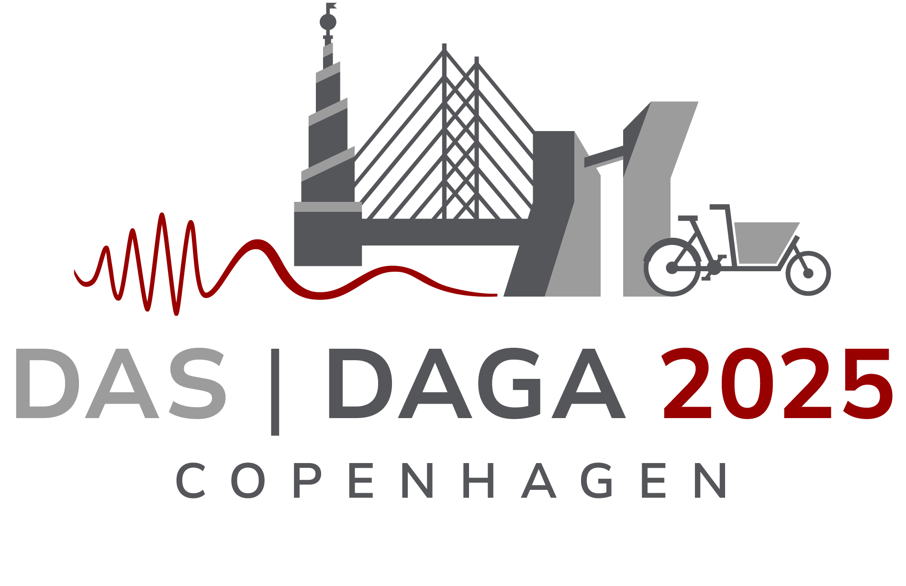

# Acoular Workshop – DAS | DAGA 2025

<!-- logo size should be small here, use html  -->

<div class="logo-container">
  
  
  
</div>

<style>
  .logo-container {
    display: flex;
    justify-content: center;
    align-items: center;
    gap: 20px; /* Adjust spacing */
  }
  .logo {
    height: 100px; /* Set a fixed height */
    width: auto; /* Maintain aspect ratio */
  }
</style>


Official collection of Jupyter notebooks, presented at the DAS|DAGA 2025 conference during the session **Acoular Workshop: Accessible and Reproducible Microphone Array Signal Processing with Python**

Session details: [DAS|DAGA 2025](https://app2025.daga-tagung.de/konferenz?session=21)

## Schedule

* 0. **Accessible and Reproducible Microphone Array Signal Processing with Python**
* 1. **Getting Started with Acoular**
* 2. **Generating Synthetic Sound Pressure Time Datasets of Multicopter Drone Fly-bys**
* 3. **Beamforming in the time domain with moving sources**
* 4. **An Interactive Tutorial on Advanced Microphone Array Methods for Acoustic Source Mapping**
* 5. **Modelling flow environments for the correction of aeroacoustic microphone array measurements**
* 6. **Acoustic Data Acquisition and Processing in Python using a MEMS Microphone Array**
* 7. **Comparison of Embedded Hardware Platforms for Optimized Machine Learning-Based Acoustic Imaging**    

## Installation

Installation with `conda`, `mamba` or `micromamba`:

* install dependencies including `nbclassic` to use the classic notebook interface

```bash
conda env create -f env.yml
```

Run the notebooks:

```bash
conda run -n acoular-workshop-das-daga-25 jupyter nbclassic
```

## Acoular Future Directions Survey

Please take five minutes to fill out the Acoular Future Directions Survey: [Acoular Future Directions Survey](https://adku1173.limesurvey.net/432223?lang=en)
This is a survey about needs and future expectations regarding Acoular. 
It addresses existing users and those who may become users in academia, other institutions, and fields other than acoustic testing.

