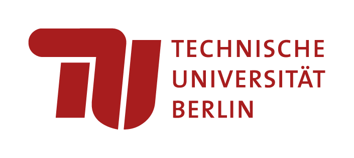

# Acoular Workshop – DAS | DAGA 2025





Official collection of Jupyter notebooks, presented at the DAS|DAGA 2025 conference during the session **Acoular Workshop: Accessible and Reproducible Microphone Array Signal Processing with Python**

Session details: [DAS|DAGA 2025](https://app2025.daga-tagung.de/konferenz?session=21)

## Schedule

* 0. **Acoular Workshop: Accessible and Reproducible Microphone Array Signal Processing with Python**
* 1. **Acoular Workshop: Getting Started with Acoular**
* 2. **Acoular Workshop: Generating Synthetic Sound Pressure Time Datasets of Multicopter Drone Fly-bys**
* 3. **Acoular Workshop: Beamforming in the time domain with moving sources**
* 4. **Acoular Workshop: An Interactive Tutorial on Advanced Microphone Array Methods for Acoustic Source Mapping**
* 5. **Acoular Workshop: Modelling flow environments for the correction of aeroacoustic microphone array measurements**
* 6. **Acoular Workshop: Acoustic Data Acquisition and Processing in Python using a MEMS Microphone Array**
* 7. **Comparison of Embedded Hardware Platforms for Optimized Machine Learning-Based Acoustic Imaging**    

## Installation

Installation with `conda`, `mamba` or `micromamba`:

* install dependencies including `nbclassic` to use the classic notebook interface

```bash
conda env create -f env.yml
```

Run the notebooks:

```bash
conda run -n acoular-workshop-das-daga-25 jupyter nbclassic
```

## Acoular Future Directions Survey

Please take five minutes to fill out the Acoular Future Directions Survey: [Acoular Future Directions Survey](https://adku1173.limesurvey.net/432223?lang=en)
This is a survey about needs and future expectations regarding Acoular. 
It addresses existing users and those who may become users in academia, other institutions, and fields other than acoustic testing.

[SurveyQR](img/.png)